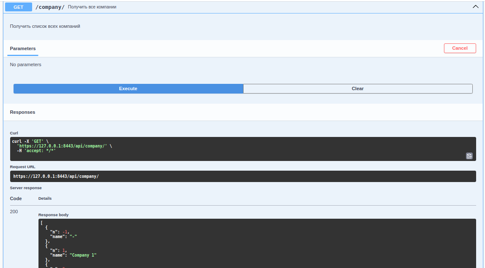
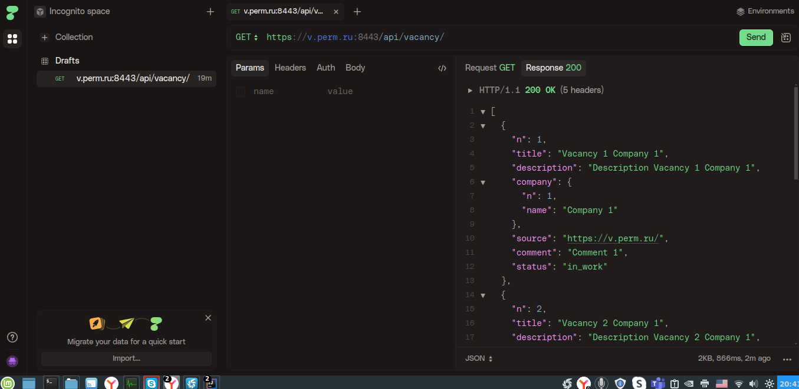
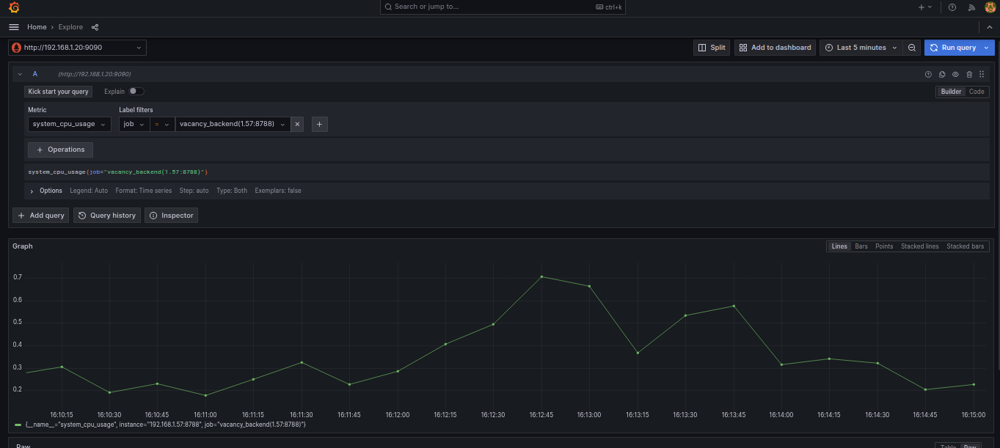

### Backend проекта "Вакансии" на Java и Camunda

#### Цель

Создать приложение на Java и Camunda для проекта "Ищу работу"


ОБЯЗАТЕЛЬНО установить имя и пароль для доступа к базе данных postgres:

````shell
export PG_USER=user
export PG_PASSWORD=pass

````

### UNIT тестирование

Прогон unit тестов:

````shell
./gradlew test
````

Интеграционные тесты исключены из фазы UNIT Тестирования в build.gradle:

````shell
test {
    finalizedBy jacocoTestReport
    filter {
        //exclude a INTEGRATION test class.
        excludeTestsMatching "*IntegrationTest"
    }
}
````

Тестирование с отчетом jacoco (jacoco.sh):

````shell
 ./gradlew test jacocoTestReport
````

Результат в build/reports/jacoco/test/html/index.html.

Запуск приложения:

````shell
./gradlew bootRun
````

Порт приложения 8443 установлен в application.yaml:

````yaml
server:
  port: 8443

````

Тест
[https://v.perm.ru:8443/api/vacancy/](https://v.perm.ru:8443/api/vacancy/)

Использован flyway. Для обновления структуры базы данных выполнить:

````shell
./gradlew flywayMigrate
````

или

````shell

./gradlew flywayMigrate -Dflyway.url=jdbc:postgresql://192.168.1.20:5432/vacancy -Dflyway.user=vasi -Dflyway.password=pass
````
 
export JAVA_HOME=/usr/lib/jvm/java-17-openjdk-amd64

http POST :8090/api/vacancy/find < src/resources/VacancyCriterySearchByName.json

Для работы с базой данных использован org.springframework.data.jpa.domain.Specification. Пример в ru.perm.v.vacancy_j.service.impl.VacancyServiceImpl.findByCritery(...) :

````java
    public List<VacancyDto> findByCritery(VacancyCriterySearch criterySearch) {
    log.info(format("Find vacancy by criterySearch: %s", criterySearch));

    Specification<VacancyEntity> spec = VacancySpecifications.hasNGreaterThan(-1L);

    if (criterySearch.getNn().size() > 0) {
        log.info("add NN to critery");
        spec = spec.and(VacancySpecifications.N_In(criterySearch.getNn()));
    }

    if (!criterySearch.getByName().isEmpty()) {
        log.info("add NAME to critery");
        spec = spec.and(VacancySpecifications.hasTitleLike(criterySearch.getByName()));
    }

    List<VacancyEntity> entities = vacancyRepository.findAll(spec);
    for (VacancyEntity v : entities) {
        log.info(format("Find vacancy by title %s", v.toString()));
    }
    return vacancyMapper.toListDto(entities);
}
````

Тест ru.perm.v.vacancy_j.service.impl.VacancyServiceImplIntegrationTest:

````shell
    @Test
    void findByCriteryWithInNNAndLikeName() {
        VacancyService vacancyService = new VacancyServiceImpl(vacancyRepository);
        VacancyCriterySearch criterySearch = new VacancyCriterySearch();
        criterySearch.setNn(List.of(1L, 3L));
        criterySearch.setByName("%Company 1");
        List<VacancyDto> vacancies = vacancyService.findByCritery(criterySearch);

        assertEquals(1, vacancies.size());
        assertEquals(1L, vacancies.get(0).getN());
     }
````

#### Swagger

Доступен по [https://127.0.0.1:8443/api/swagger-ui/index.html](https://127.0.0.1:8443/api/swagger-ui/index.html)



(Swagger работает через __HTTPS__)

 Доступ на сервере [https://v.perm.ru:8443/api/swagger-ui/index.html](https://v.perm.ru:8443/api/swagger-ui/index.html).


#### Тестовые запросы:

__Для HTTPS.__

__1.__ Можно использовать swagger (см. [Swagger](#swagger)).


__2.__ Можно использовать утилиту HTTPIE  [https://httpie.io](https://httpie.io):

Для проверок на локальном компьютере. __КЛЮЧЕВОЙ ПАРАМЕТР__ --verify=no:

````shell
$ https --verify=no https://localhost:8090/api/echo/MESSAGE_ECHO

HTTP/1.1 200 
Connection: keep-alive
Content-Length: 7
Content-Type: text/plain;charset=ISO-8859-1
Keep-Alive: timeout=60
Vary: Origin, Access-Control-Request-Method, Access-Control-Request-Headers

MESSAGE
````

````shell
$ https --verify=no https://127.0.0.1:8090/api/company/ | jq
[
  {
    "n": -1,
    "name": "-"
  },
  {
    "n": 1,
    "name": "Company 1"
  },
  {
    "n": 2,
    "name": "Company 2"
  }
]
````

При работе приложением на сервере этот параметр не нужен, т.к. на сервере https настроен.


````shell
$ https --verify=no https://127.0.0.1:8090/api/vacancy/2
(https --verify=no https://127.0.0.1:8090/api/vacancy/2 | jq)
HTTP/1.1 200 
Connection: keep-alive
Content-Type: application/json
Keep-Alive: timeout=60
Transfer-Encoding: chunked
Vary: Origin, Access-Control-Request-Method, Access-Control-Request-Headers

{
    "comment": "Comment 2",
    "company": {
        "n": 1,
        "name": "Company 1"
    },
    "description": "Description Vacancy 2 Company 1",
    "n": 2,
    "source": "Link 21",
    "status": "in_work",
    "title": "Vacancy 2 Company 1"
}

$ https --verify=no https://127.0.0.1:8090/api/vacancy/2 | jq
{
  "n": 2,
  "title": "Vacancy 2 Company 1",
  "description": "Description Vacancy 2 Company 1",
  "company": {
    "n": 1,
    "name": "Company 1"
  },
  "source": "Link 21",
  "comment": "Comment 2",
  "status": "in_plan",
  "dateChanged": "18.11.2025"
}

$ echo "{\"nn\": [1,2]}" | https --verify=no https://127.0.0.1:8090/api/company/find
[
    {
        "n": 1,
        "name": "Company 1"
    },
    {
        "n": 2,
        "name": "Company 2"
    }
]

````

__3.__ Ручные тестовые запросы HTTPS через CURL (использовать ключ --insecure):

````shell
curl -X 'GET' --insecure https://127.0.0.1:8090/api/company/2
curl -X 'GET' --insecure https://192.168.1.79:8090/api/company/2 
````

форматированный вывод и статистика (использован jq):

````shell
curl -X 'GET' --insecure https://127.0.0.1:8090/api/company/2 | jq
  % Total    % Received % Xferd  Average Speed   Time    Time     Time  Current
                                 Dload  Upload   Total   Spent    Left  Speed
100    19    0    19    0     0    463      0 --:--:-- --:--:-- --:--:--   463
{
  "n": -1,
  "name": "-"
}
````

__4.__ Ручные тестовые запросы через браузер:
[https://127.0.0.1:8090/api/company/2](https://127.0.0.1:8090/api/company/2)

````
{
    "n": 2,
    "name": "Company 2"
}
````

[https://127.0.0.1:8090/api/vacancy/2](https://127.0.0.1:8090/api/vacancy/2)

````
{
    "comment": "",
    "company": {
        "n": 1,
        "name": "Company 1"
    },
    "description": "Description Vacancy 2 Company 1",
    "n": 2,
    "source": "",
    "title": "Vacancy 2 Company 1"
}
````

[https://127.0.0.1:8090/api/vacancy/](https://127.0.0.1:8090/api/vacancy/)

````
[
    {
        "comment": "",
        "company": {
            "n": 1,
            "name": "Company 1"
        },
        "description": "Description Vacancy 2 Company 1",
        "n": 2,
        "source": "",
        "title": "Vacancy 2 Company 1"
    },
    ....
]
````

#### Сборка jar файла

Подключен gradle plugin в build.gradle:

````shell
springBoot {
    buildInfo()
}
````

Сборка:

````shell
./gradlew bootJar
````

[./build_jar.sh](./build_jar.sh)

Запуск jar файла:

````shell
/usr/lib/jvm/java-17-openjdk-amd64/bin/java -jar vacancy_backend-0.0.1-SNAPSHOT.jar
````

запуск на другом порту:

````shell
/usr/lib/jvm/java-17-openjdk-amd64/bin/java -Dserver.port=8090 -jar build/libs/vacancy_backend-0.0.1-SNAPSHOT.jar
````

#### WAR

Для создания _war_ файлв в build.gradle добавить:

````shell
apply plugin:'war'

war {
    enabled=true
}

````

сборка:

````shell
./gradlew bootWar
````

#### PROD запуск

Выполнить [./build_jar.sh](./build_jar.sh). Файл build/libs/vacancy_backend-0.0.1-SNAPSHOT.jar скопировать на web сервер. Запустить backend:

````shell
/usr/lib/jvm/java-17-openjdk-amd64/bin/java -jar vacancy_backend-0.0.1-SNAPSHOT.jar
````

На этом же сервере разместить [~/prog/js/vacancy_frontend_17](https://github.com/cherepakhin/vacancy_frontend_17). Как заместить в проекте описано. (скопировать каталог vacancy_frontend_17/build в каталог apache2 /var/www/main/vacancies).

#### Настройка HTTPS

Делается в секции __server__ [application.yaml](./src/main/resources/application.yaml):
````yaml
server:
  port: 8443
  ssl.key-store: /home/vasi/prog/sert/keystore.p12
  ssl.key-store-password: B..67
  ssl.keyStoreType: PKCS12
  ssl.keyAlias: tomcat

security.require-ssl: true
````

Сертификат 	Let's Encrypt.

На сервере (не на ноутбуке!!!) в папке /home/vasi/prog/sert.

#### Запуск

На сервере (не на ноутбуке, папка __v:~/temp/vacancy__):

````shell
v:~/temp/vacancy$ java -jar vacancy_backend-0.0.1-SNAPSHOT.jar
````

Для тестирования prod на https://v.perm.ru можно использовать [https://httpie.io/app](https://httpie.io/app). Пример запроса GET на [https://v.perm.ru:8443/api/vacancy/](https://v.perm.ru:8443/api/vacancy/) :



#### Ручные тесты на localhost через __браузер___

[https://127.0.0.1:8443/api/echo/MESSAGE](https://127.0.0.1:8443/api/echo/MESSAGE)
[https://127.0.0.1:8443/api/company/](https://127.0.0.1:8443/api/company/)
    
#### Тесты на prod

````shell
https https://v.perm.ru:8443/api/echo/MESSAGE_ECHO
https https://v.perm.ru:8443/api/company/2
echo "{\"nn\": [2]}" | https --verify=no POST https://127.0.0.1:8443/api/company/find     
````

TODO: Можно использовать swagger [https://127.0.0.1:8443/api/swagger-ui/index.html#/](https://127.0.0.1:8443/api/swagger-ui/index.html#/)

Без HTTPS проверки сертификатов:

````shell
https --verify=no https://127.0.0.1:8443/api/echo/MESSAGE_ECHO
curl -k https://127.0.0.1:8443/api/echo/MESSAGE_ECHO
````

#### Frontend

Сделан frontend [https://v.perm.ru/vacancies/](https://v.perm.ru/vacancies/). Проект с frontend в [https://github.com/cherepakhin/vacancy_frontend_17](https://github.com/cherepakhin/vacancy_frontend_17). Адрес backend во frontend  проекте указан в [http-common.js](https://github.com/cherepakhin/vacancy_frontend_17/blob/main/src/http-common.js):

````shell
export default axios.create({
  baseURL: "https://v.perm.ru:8443/api",

  mode: "no-cors",
  headers: {
    "Content-type": "application/json"
  }
});
````

Версии:

ветка v1 - сделано CRUD без авторизации
ветка auth - авторизация REST

### Размещение на linux сервере

В файле [./doc/vacancy_backend.service](./doc/vacancy_backend.service) пример настройки сервиса для Linux.

````shell
[Unit]
Description=Vacancy service
After=network.target

[Service]
Type=simple
ExecStart=/usr/lib/jvm/java-17-openjdk-amd64/bin/java -Dserver.port=8443 -jar /home/vasi/temp/vacancy/vacancy_backend-0.0.1-SNAPSHOT.jar
TimeoutStartSec=0

[Install]
WantedBy=default.target
````

Манипуляции для настройки

````shell
$ sudo systemctl daemon-reload
$ sudo systemctl enable vacancy_backend.service
$ sudo systemctl start vacancy_backend.service
$ sudo systemctl status vacancy_backend.service

● vacancy_backend.service - Vacancy service
     Loaded: loaded (/etc/systemd/system/vacancy_backend.service; enabled; pres>
     Active: active (running) 
   Main PID: 2418855 (java)
      Tasks: 42 (limit: 13882)
     Memory: 279.2M (peak: 289.5M)
        CPU: 26.100s
     CGroup: /system.slice/vacancy_backend.service
             └─2418855 /usr/lib/jvm/java-17-openjdk-amd64/bin/java -Dserver.por>

````

### Замечания по тестам со Specifications

````java
    @Test
    // Тест сделан для проверки равенства спецификаций.
    // В тестах хочется мокать запросы с "org.springframework.data.jpa.domain.Specification", НО не получается.
    // ОКАЗЫВАЕТСЯ SPECIFICATION НЕ EQUALS!!!
    // Поэтому тесты с specification ПРИДЕТСЯ ДЕЛАТЬ через делать ANY().
    // Проверка равенства "org.springframework.data.jpa.domain.Specification"
    void compareSpecification() {
        List<Long> listNN = List.of(1L, 2L);

        Specification<VacancyEntity> spec1 = VacancySpecifications.hasNGreaterThan(-1L);
        spec1 = spec1.and(VacancySpecifications.N_In(listNN));

        Specification<VacancyEntity> spec2 = VacancySpecifications.hasNGreaterThan(-1L);
        spec2 = spec2.and(VacancySpecifications.N_In(listNN));

        assertNotEquals(spec1, spec2);
    }

    @Test
    void findByCriteryWithListNN() {
        CompanyEntity companyEntity = new CompanyEntity(10L, "COMPANY 10");
        VacancyEntity vacancyEntity = new VacancyEntity(100L, "TITLE 100",
                companyEntity, "DESCRIPTION 100", "SOURCE 100",
                "COMMENT 100", "", LocalDate.of(2000, 12, 31));
    //  Specification нельзя вставить для mock (см. тест выше compareSpecification())
    //        Specification<VacancyEntity> spec = VacancySpecifications.hasNGreaterThan(-1L);
        List<Long> listNN = List.of(1L, 2L);
    //        spec = spec.and(VacancySpecifications.N_In(listNN));
    
    //      Так не сработет:
    //        when(vacancyRepository.findAll(eq(spec), eq(Sort.by(Sort.Order.asc("n")))))
    //                .thenReturn(List.of(vacancyEntity));
    //      См. тест выше compareSpecification()
    // Поэтому any(Specification.class)!!! Еще раз: Specification НЕ equals.         
        when(vacancyRepository.findAll(any(Specification.class), eq(Sort.by(Sort.Order.asc("n")))))
                .thenReturn(List.of(vacancyEntity));
    
        VacancyService vacancyService = new VacancyServiceImpl(vacancyRepository);
        VacancyCriterySearch vacancyCriterySearch = new VacancyCriterySearch();
        vacancyCriterySearch.setNn(listNN);
    
        List<VacancyDto> dtos = vacancyService.findByCritery(vacancyCriterySearch);
    
        assertEquals(1, dtos.size());
        verify(vacancyRepository, times(1)).findAll(
                any(Specification.class), eq(Sort.by(Sort.Order.asc("n"))));
    }
    
````

### Прогон конкретного теста

[Прогон конкретного теста с v.perm.ru](https://v.perm.ru/index.php/component/content/article/integrtestallure?catid=15&Itemid=101)

````shell
./gradlew test --tests '*AssumptionsTest'
./gradlew test --tests ru.perm.v.vacancy_j.service.impl.CompanyServiceImplIntegrationTest
./gradlew test --tests 'ru.perm.v.vacancy_j.service.impl.CompanyServiceImplIntegrationTest*'
./gradlew test --tests '*Assumptions*'
````

### Spring Actuator

Доступен по адресу (HTTPS!!!): [https://127.0.0.1:8788/api/actuator](https://127.0.0.1:8788/api/actuator)

Примеры запросов:
[https://127.0.0.1:8788/api/actuator/info](https://127.0.0.1:8788/api/actuator/info)
Список метрик [https://127.0.0.1:8788/api/actuator/metrics](https://127.0.0.1:8788/api/actuator/metrics)
Данные конкретной метрики [https://127.0.0.1:8788/api/actuator/metrics/<метрика>](https://127.0.0.1:8788/api/actuator/metrics/<метрика>)
(Пример: [https://127.0.0.1:8788/api/actuator/metrics/system.cpu.count](https://127.0.0.1:8788/api/actuator/metrics/system.cpu.count))

#### Prometheus

URL для Prometheus [https://127.0.0.1:8788/api/actuator/prometheus](https://127.0.0.1:8788/api/actuator/prometheus)

````shell
curl -k https://127.0.0.1:8788/api/actuator/prometheus
````

Развернут Prometheus service на локальной машине. Просмотр метрик:

[http://192.168.1.20:9090/graph?g0.expr=system_cpu_usage&g0.tab=0&g0.stacked=0&g0.show_exemplars=0&g0.range_input=1h](http://192.168.1.20:9090/graph?g0.expr=system_cpu_usage&g0.tab=0&g0.stacked=0&g0.show_exemplars=0&g0.range_input=1h)

Просмотр метрик в Grafana:
[http://192.168.1.20:3000/explore?panes=%7B%22xew%22:%7B%22datasource%22:%22f9658b16-7929-4a99-9eea-36356ffa2bed%22,%22queries%22:%5B%7B%22refId%22:%22A%22,%22expr%22:%22system_cpu_usage%7Bjob%3D%5C%22vacancy_backend%281.57:8788%29%5C%22%7D%22,%22range%22:true,%22instant%22:true,%22datasource%22:%7B%22type%22:%22prometheus%22,%22uid%22:%22f9658b16-7929-4a99-9eea-36356ffa2bed%22%7D,%22editorMode%22:%22builder%22,%22legendFormat%22:%22__auto%22,%22useBackend%22:false,%22disableTextWrap%22:false,%22fullMetaSearch%22:false,%22includeNullMetadata%22:true%7D%5D,%22range%22:%7B%22from%22:%22now-5m%22,%22to%22:%22now%22%7D%7D%7D&schemaVersion=1&orgId=1](http://192.168.1.20:3000/explore?panes=%7B%22xew%22:%7B%22datasource%22:%22f9658b16-7929-4a99-9eea-36356ffa2bed%22,%22queries%22:%5B%7B%22refId%22:%22A%22,%22expr%22:%22system_cpu_usage%7Bjob%3D%5C%22vacancy_backend%281.57:8788%29%5C%22%7D%22,%22range%22:true,%22instant%22:true,%22datasource%22:%7B%22type%22:%22prometheus%22,%22uid%22:%22f9658b16-7929-4a99-9eea-36356ffa2bed%22%7D,%22editorMode%22:%22builder%22,%22legendFormat%22:%22__auto%22,%22useBackend%22:false,%22disableTextWrap%22:false,%22fullMetaSearch%22:false,%22includeNullMetadata%22:true%7D%5D,%22range%22:%7B%22from%22:%22now-5m%22,%22to%22:%22now%22%7D%7D%7D&schemaVersion=1&orgId=1)



### Тестирование Spring bean с @TestConfiguration

Внедрение Spring bean в тест с @Import
Вся механика описана в тесте.
[Testing with Spring Boot’s @TestConfiguration Annotation](https://reflectoring.io/spring-boot-testconfiguration/)

### Создание Spring Beans из файла

Класс [ru.perm.v.vacancy_j.conf.CreatorExtListSite.java](src/main/java/ru/perm/v/vacancy_j/conf/CreatorExtListSite.java) создает список Spring bean List<JobSiteDto> с параметрами заданном во внешнем файле  [resources/job_sites.csv](resources/job_sites.csv).

### Ссылки
[Get JSON Content as Object Using MockMVC](https://www.baeldung.com/spring-mockmvc-fetch-json)